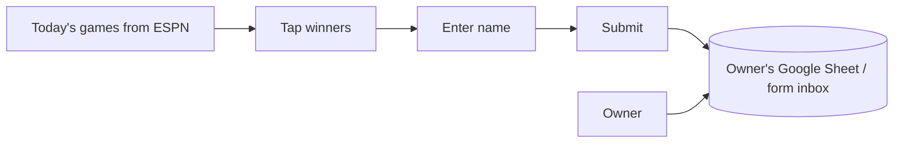

# Plan: Collecting bracket / pick submissions

Status: **Draft for review — not started.** Last updated 2026-06-30.

This captures the scoping discussion so we can revisit it anytime. Nothing here
is built yet.

## Goal

Let friends fill out picks and **submit them back to Eleanor** so she can see
everyone's entries (and eventually score them).

## The core constraint

The app is a **static site** (GitHub Pages, no backend). Picks currently live
only in the browser (`localStorage`) and results come from ESPN. "Submit back to
me" means picks must leave the user's device and land somewhere the owner can
see — which requires a third-party collector, since we have no server.

## Collection options

| Option | How picks reach the owner | Setup | Friend friction | Owner friction |
|---|---|---|---|---|
| **A. No-code form service** (Google Sheet via Apps Script, or Formspree / Web3Forms) | App POSTs picks to the service; owner sees them in a sheet, dashboard, or email | Sign up once, paste a key/URL | Tap "Submit" | Low |
| **B. Share-link collection** | Friend sends their bracket link (picks already encode in the URL); owner pastes links into an "admin" view that decodes them into a table | None | Copy link, send via text/DM | Manual (gather links) |
| **C. GitHub Issue / serverless + DB** | Prefilled GitHub issue, or a real API + database (Vercel/Netlify/Cloudflare + Supabase/Airtable) | More | Needs GitHub acct / more steps | More |

### Recommended approach

**Option A with a Google Sheet (Apps Script endpoint)** — closest to "they
submit, it shows up in my list," no login for friends, free, and the owner gets
a live spreadsheet to sort/score. Web3Forms/Formspree are good alternatives if
an email/dashboard is preferred over a sheet.

## Recommended first slice: "Today's games" MVP

Instead of collecting full 31-match brackets up front, start with a **daily
pick'em**:

- We **already fetch today's matches** from ESPN (powers the live banner +
  schedule), so the data is free.
- User sees today's 2–3 knockout games, taps a winner for each, enters their
  **name**, and hits **Submit**.
- The submission (name + date + picks) lands in the owner's sheet/inbox.
- Picks **lock at kickoff** so nobody submits after a game starts.



## Draft data model (per submission)

```json
{
  "name": "Alex",
  "submittedAt": "2026-06-30T18:05:00Z",
  "day": "2026-06-30",
  "picks": [
    { "matchId": 77, "teams": "FRA-SWE", "pick": "FRA" },
    { "matchId": 79, "teams": "MEX-ECU", "pick": "MEX" }
  ]
}
```

## Decisions still needed

1. **Collection method** — Google Sheet, a form service (Formspree/Web3Forms),
   or no-signup share-link collection?
2. **Scope** — today's games only (MVP) or full bracket submission?
3. **Identity** — just a typed name, or also dedupe (one per name/day)? Any
   login? (Suggested: just a name, keep it casual.)
4. **Locking** — should picks lock at each game's kickoff?
5. **Auto-scoring later** — compare submissions to real ESPN results and rank
   friends? (Affects how we store data now.)

### Suggested defaults

Google Sheet + today's-games MVP + name only + lock at kickoff + scoring later.

## Phased roadmap

- **Phase 1 — Submit today's picks.** Today's-games view, name entry, POST to
  the chosen collector, kickoff lock. Owner reads submissions manually.
- **Phase 2 — Auto-scoring.** Compare each submission to `results.json`/ESPN,
  show a leaderboard (could be owner-only or public).
- **Phase 3 — Full-bracket submission.** Extend from daily picks to the whole
  knockout bracket, with the same collector + scoring.

## Risks / things to watch

- **Spam / abuse:** an open form endpoint can receive junk. Use the service's
  spam protection (honeypot, access key) and treat submissions as untrusted.
- **CORS:** the collector must allow browser POSTs (Formspree/Web3Forms do;
  Apps Script needs a simple form-encoded POST, response not readable).
- **No real identity:** names can collide or be faked — fine for a casual pool,
  not for anything competitive with stakes.
- **Free-tier limits:** form services cap monthly submissions (e.g., Formspree
  free ≈ 50/mo); a Google Sheet has effectively no cap.

## Notes / things we can reuse

- Picks already serialize to a compact URL-safe string (`src/share.ts`) — handy
  for Option B and for compactly storing a submission.
- `results.json` (auto-updated every 15 min from ESPN) gives us the truth source
  for Phase 2 scoring with no extra work.
